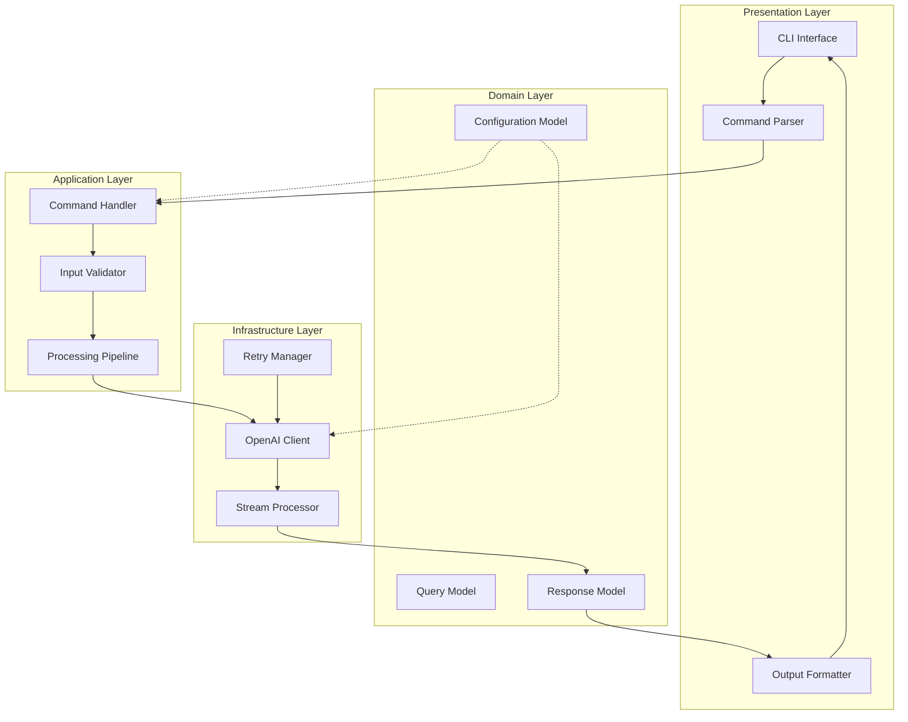
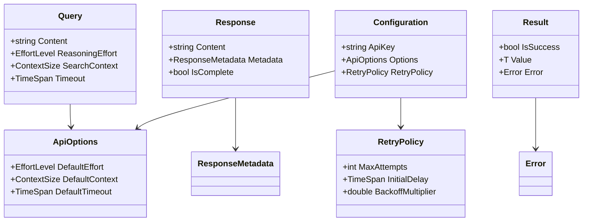
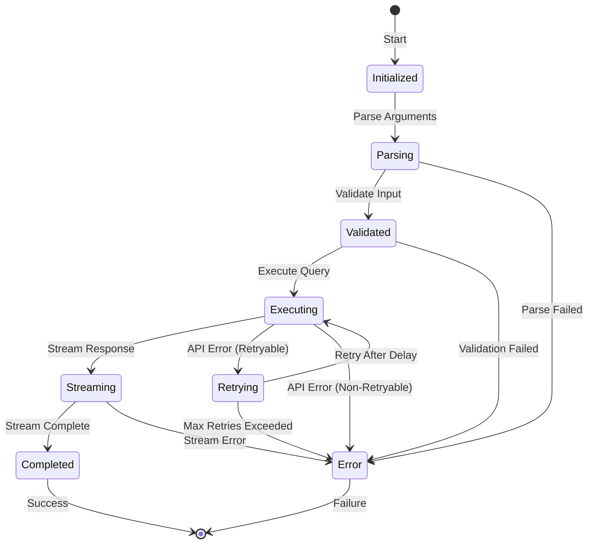

# Qx 設計書

---
version: 1.0.0
last_updated: 2025-08-12
author: Development Team
status: draft
---

## 📐 アーキテクチャ概要

### システム全体構成



### レイヤー構成

```
┌─────────────────────────────────────────────┐
│          Presentation Layer                 │
│  • CLI エントリポイント                      │
│  • コマンドライン解析                        │
│  • 出力フォーマット制御                      │
├─────────────────────────────────────────────┤
│          Application Layer                  │
│  • ビジネスロジック調整                      │
│  • ワークフロー制御                          │
│  • バリデーション                            │
├─────────────────────────────────────────────┤
│             Domain Layer                    │
│  • ドメインモデル定義                        │
│  • ビジネスルール                            │
│  • 値オブジェクト                            │
├─────────────────────────────────────────────┤
│         Infrastructure Layer                │
│  • 外部API通信                               │
│  • リトライ処理                              │
│  • ストリーミング処理                        │
└─────────────────────────────────────────────┘
```

### 依存関係の方向

- 上位レイヤーは下位レイヤーに依存
- 下位レイヤーは上位レイヤーを知らない
- 横断的関心事（ロギング、エラー処理）は各レイヤーで独立して処理

## 🏗️ 設計原則

### 採用する設計パターン

#### 1. Command パターン
- **目的**: CLIコマンドの処理を統一的に扱う
- **適用箇所**: 各コマンド（query、help、version）の実装
- **利点**: 新しいコマンドの追加が容易、テスト可能性の向上

#### 2. Strategy パターン
- **目的**: 出力形式の切り替えを柔軟に行う
- **適用箇所**: 標準出力、エラー出力、構造化出力の切り替え
- **利点**: 新しい出力形式の追加が既存コードに影響しない

#### 3. Pipeline パターン
- **目的**: 処理の流れを明確に定義
- **適用箇所**: 入力→検証→API呼び出し→出力の処理フロー
- **利点**: 各ステップの責務が明確、処理の追加・削除が容易

#### 4. Retry パターン（指数バックオフ）
- **目的**: 一時的な障害からの自動回復
- **適用箇所**: OpenAI API呼び出し
- **利点**: ネットワーク障害への耐性向上

### アーキテクチャ原則

#### SOLID原則の適用

1. **単一責任原則（SRP）**
   - 各クラスは1つの責務のみを持つ
   - 変更理由は1つに限定

2. **開放閉鎖原則（OCP）**
   - 拡張に対して開き、修正に対して閉じる
   - インターフェースを通じた拡張性確保

3. **リスコフ置換原則（LSP）**
   - 派生型は基底型と置換可能
   - インターフェース契約の遵守

4. **インターフェース分離原則（ISP）**
   - クライアントが不要なメソッドに依存しない
   - 小さく焦点を絞ったインターフェース

5. **依存性逆転原則（DIP）**
   - 具象ではなく抽象に依存
   - DIコンテナによる依存性注入

#### その他の原則

- **DRY（Don't Repeat Yourself）**: 重複を避ける
- **YAGNI（You Aren't Gonna Need It）**: 必要になるまで実装しない
- **KISS（Keep It Simple, Stupid）**: シンプルさを保つ

## 🧩 コンポーネント設計

### 主要コンポーネント

#### 1. CLI Interface
**責務:**
- コマンドライン引数の受付
- ヘルプメッセージの表示
- 終了コードの管理

**インターフェース:**
```
ICliInterface
├── ParseArguments(args: string[]): ParsedCommand
├── ShowHelp(): void
└── Exit(code: int): void
```

#### 2. Command Handler
**責務:**
- コマンドの実行調整
- パイプライン処理の制御
- エラーハンドリング

**インターフェース:**
```
ICommandHandler
├── ExecuteAsync(command: ParsedCommand): Task<Result>
├── ValidateInput(input: QueryInput): ValidationResult
└── ProcessResponse(response: ApiResponse): ProcessedResult
```

#### 3. OpenAI Client
**責務:**
- OpenAI APIとの通信
- リクエスト/レスポンスの変換
- ストリーミング処理

**インターフェース:**
```
IOpenAIClient
├── SendQueryAsync(query: Query): Task<Response>
├── StreamQueryAsync(query: Query): IAsyncEnumerable<Chunk>
└── ConfigureOptions(options: ApiOptions): void
```

#### 4. Configuration Manager
**責務:**
- 環境変数の読み取り
- コマンドライン引数の管理
- デフォルト値の提供

**インターフェース:**
```
IConfigurationManager
├── GetApiKey(): string
├── GetTimeout(): TimeSpan
├── GetReasoningEffort(): EffortLevel
└── GetSearchContext(): ContextSize
```

#### 5. Output Formatter
**責務:**
- 出力形式の制御
- ストリーミング出力の処理
- エラーメッセージのフォーマット

**インターフェース:**
```
IOutputFormatter
├── FormatResponse(response: Response): string
├── FormatError(error: Error): string
└── StreamOutput(chunks: IAsyncEnumerable<string>): Task
```

#### 6. Retry Manager
**責務:**
- リトライロジックの実装
- 指数バックオフの計算
- リトライ可能エラーの判定

**インターフェース:**
```
IRetryManager
├── ExecuteWithRetryAsync<T>(operation: Func<Task<T>>): Task<T>
├── CalculateDelay(attempt: int): TimeSpan
└── IsRetryable(exception: Exception): bool
```

### コンポーネント間の相互作用

```
User Input
    ↓
CLI Interface ← Configuration Manager
    ↓
Command Parser
    ↓
Command Handler ← Input Validator
    ↓
Processing Pipeline
    ↓
OpenAI Client ← Retry Manager
    ↓
Stream Processor
    ↓
Output Formatter
    ↓
User Output
```

## 📊 データ設計

### 概念データモデル



### 状態遷移



### データフロー

```
1. 入力フェーズ
   ユーザー入力 → CLIパラメータ → Query オブジェクト

2. 処理フェーズ
   Query → API Request → Stream<Chunk> → Response

3. 出力フェーズ
   Response → Formatted Output → 標準出力/エラー出力
```

## 🔌 統合ポイント

### 外部システム連携

#### OpenAI API
**連携方式:**
- RESTful API（HTTPS）
- 認証: Bearer Token（APIキー）
- データ形式: JSON

**エンドポイント設計:**
```
POST /v1/chat/completions
├── Headers
│   ├── Authorization: Bearer {API_KEY}
│   └── Content-Type: application/json
├── Body
│   ├── model: string
│   ├── messages: array
│   ├── stream: boolean
│   └── options: object
└── Response
    ├── Success: 200 OK
    ├── RateLimit: 429 Too Many Requests
    └── Error: 4xx/5xx
```

### API設計方針

#### 1. 抽象化レベル
- 外部API詳細を隠蔽
- ドメインモデルでの操作
- 将来的なAPI変更への耐性

#### 2. エラーハンドリング
```
エラー分類:
├── 一時的エラー（リトライ可能）
│   ├── ネットワークエラー
│   ├── タイムアウト
│   └── レート制限
└── 永続的エラー（リトライ不可）
    ├── 認証エラー
    ├── 不正なリクエスト
    └── サーバーエラー
```

#### 3. ストリーミング処理
- Server-Sent Events（SSE）対応
- チャンク単位での処理
- バッファリング制御
- エラー時の部分出力保証

#### 4. パフォーマンス最適化
- 接続プーリング
- Keep-Alive接続
- 適切なタイムアウト設定
- リソースの適切な解放

### 拡張ポイント

将来的な拡張を考慮した設計：

1. **新しいAIプロバイダー追加**
   - IApiClient インターフェースの実装
   - プロバイダー固有の設定追加

2. **出力形式の追加**
   - IOutputFormatter の新実装
   - フォーマット選択ロジックの拡張

3. **コマンドの追加**
   - ICommand インターフェースの実装
   - コマンドレジストリへの登録

## 🔄 非同期処理設計

### 完全非同期アーキテクチャ

```
┌──────────────────────────────────────┐
│  すべての I/O 操作を非同期で実行      │
│  • API呼び出し                       │
│  • ストリーミング処理                 │
│  • 出力処理                          │
└──────────────────────────────────────┘
            ↓
┌──────────────────────────────────────┐
│     async/await パターンの徹底        │
│  • Task ベースの API                 │
│  • ConfigureAwait(false) の使用      │
│  • 適切なキャンセレーション          │
└──────────────────────────────────────┘
```

### ストリーミングレスポンス処理

```
API Response Stream
    ↓
IAsyncEnumerable<Chunk>
    ↓
Transform Pipeline
    ├── Parse JSON
    ├── Extract Content
    └── Handle Errors
    ↓
Output Stream
    ├── Console Output
    └── Buffer Management
```

## 📋 設計上の考慮事項

### セキュリティ
- APIキーの安全な管理
- 入力値のサニタイゼーション
- エラーメッセージでの情報漏洩防止

### パフォーマンス
- 起動時間の最小化
- メモリ使用量の最適化
- ストリーミングによる低レイテンシ

### 保守性
- 明確な責務分離
- テスタビリティの確保
- ログ出力なし（設計要件）

### 互換性
- 標準入出力との互換性
- パイプライン処理対応
- 終了コードの適切な設定

## 🔄 変更履歴

| 日付 | バージョン | 変更内容 | 変更者 |
|------|------------|----------|--------|
| 2025-08-12 | 1.0.0 | 初版作成 | Development Team |

---

*このドキュメントは設計の概要を示すものです。実装の詳細は個別のドキュメントを参照してください。*